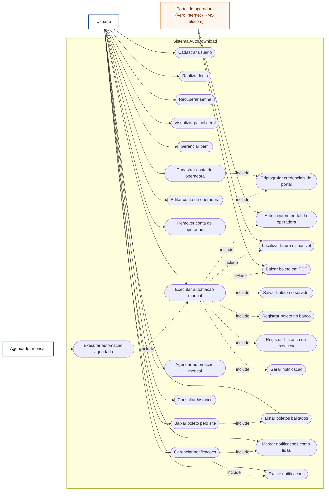

# Diagrama de Casos de Uso - AutoDownload

## Atores

- **Usuario:** pessoa que acessa o AutoDownload para cadastrar contas, executar automacoes, baixar boletos e acompanhar historico/notificacoes.
- **Agendador mensal:** processo automatico do sistema que verifica contas com agendamento ativo e inicia a automacao no periodo configurado.
- **Portal da operadora:** sistemas externos das operadoras, como Vero Internet e RMS Telecom, acessados pela automacao para localizar e baixar boletos.

## Principais Casos de Uso

- **Autenticacao:** cadastrar usuario, realizar login, recuperar senha e manter sessao protegida por JWT.
- **Gestao de contas:** cadastrar, editar, remover e proteger credenciais das contas de operadoras.
- **Automacao de boletos:** executar manualmente ou por agendamento, acessar portal externo, localizar fatura, baixar PDF e registrar resultado.
- **Acompanhamento:** visualizar painel geral, listar boletos, baixar arquivos, consultar historico e receber notificacoes.
- **Notificacoes:** marcar como lidas, remover notificacoes individuais ou limpar todas.
